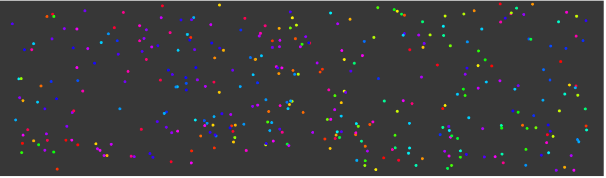

# textpoints

A Quil sketch showing a text as points. Points will move to their target location, or flee
from the mouse if the cursor is less than 50px away from it.

Based on Coding Challenge #59 of The Coding Train Youtube channel: 
https://www.youtube.com/watch?v=4hA7G3gup-4

## Usage

Run `lein figwheel` in your terminal. Wait for a while until you see `Successfully compiled "resources/public/js/main.js"`. Open [localhost:3449](http://localhost:3449) in your browser.

You can use this while developing your sketch. Whenever you save your source files the browser will automatically refresh everything, providing you with quick feedback. For more information about Figwheel, check the [Figwheel repository on GitHub](https://github.com/bhauman/lein-figwheel).

Once the sketch is loaded, use:

- left mouse button to reset the current word: all points will get a random location and will move to their target location
- right arrow key transitions to the next word in the sentence. Points will be reused when possible.

## License

Copyright © 2019 J.W. Koelewijn

Distributed under the MIT License.
